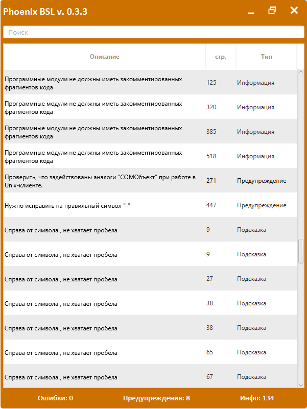

# Phoenix BSL для 1С

**В СТАДИИ РАЗРАБОТКИ, ИСПОЛЬЗУЙТЕ НА СВОЙ СТРАХ И РИСК =)**

## Описание

Проект позволяет анализировать и форматировать код 1С в конфигураторе. Инструмент основан на проекте [BSL LS](https://github.com/1c-syntax/bsl-language-server).



## Установка

Установить приложение можно двумя способами:
* Через msi из релизов или сборок GitHub Action
* Запустить отдельно jar файл (нужно подготовить каталоги, почти во всех случаях это нужно для тестирования данного проекта).

### Установка msi

1. Качаем из релизов файл msi.
2. Устанавливаем на компьютере.
3. Первый раз запускаем под администратором (иначе не работает обработка нажатий кнопок, пока проблема решается).

### Запуск через jar

1. На компьютере должна быть установлена Java не ниже 11 версии. Если нет - устанавливаем.
2. Создаем новый каталог, из релизов копируем файл jar.
3. В каталог создаем каталог app, извлекаем в него архив bsl-language-server_win.zip из релизов проекта [BSL LS](https://github.com/1c-syntax/bsl-language-server/releases/latest).
4. Запускаем jar файл из консоли:
```cmd
java -jar phoenix-{version}.jar 
```
где {version} - версия приложения.

Например:
```cmd
java -jar phoenix-0.3.3.jar 
```

## Как пользоваться

После запуска приложения в конфигураторе нажимаем в модуле с кодом:
* `CTRL` + `I` - анализ кода на замечания.
* `CTRL` + `K` - форматирование кода.

Так же стоит отметить, что анализ и форматирование работает по выделенному коду.

### Настройки
Настроки приложения размещены: Трей приложения -> Настройки.
Доступно следующее:
* Открыть каталог с логами приложения. Логирование ведется всегда. История сохраняется за последние 7 дней.
* `Использовать BSL LS jar` - определяет, будет ли запущен BSL LS через java. По умолчанию выключено.
* `Путь к JAVA` - путь к Java. Если значение `java` - то берется из PATH системы. 
Для запуска приложения требуется Java не ниже версии 11. 
* `Путь к BSL LS` - путь к приложению BSL LS. Либо это путь к jar файлу (если выключена опция `Использовать BSL LS jar`), либо это 
путь к файлу `bsl-language-server.exe`.

## Разработка

Разработка ведется по git flow. В разработке используется платформа JAVA не ниже 11 версии.

## Развитие
Идеи, фидбек, баги по проекту кидаем в раздел Досад [Issues](https://github.com/otymko/phoenixbsl/issues).


**P.S.** Зачем это, если есть Снегопат, Turboconf, SmartConfigurator и т.п.? 
Ответ -> использование языка Java, открытый исходный код, прокачка в разработке на Java.
